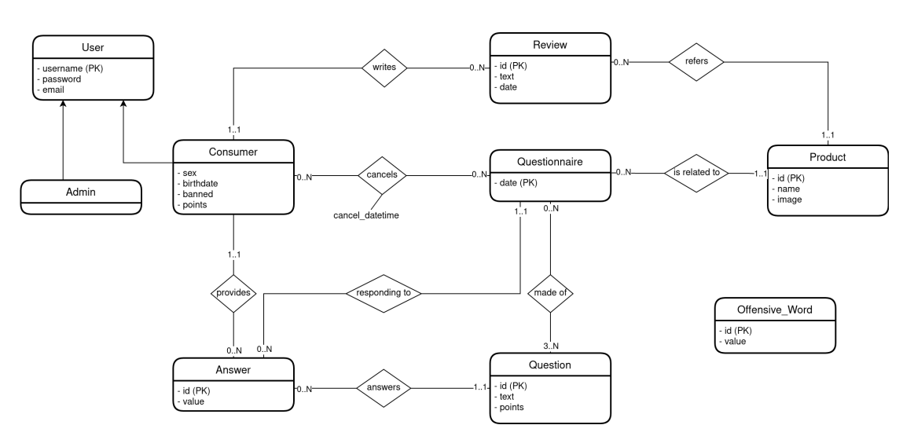

# Data Bases 2 project
Goal is to develop an easy-to-use web application whose main goal is to make reviews about products.

# Database Schema
In the following picture it is represented the design of the database schema.

# Features and Functionalities
The main features that were implemented for the User are the following:
 - Make reviews about "Product of the Day"
 - Fill in a Questionnarie composed of marketing questions and data about the user;
 - Show user leaderboard based on how much they are active on the application;

The main features that were implemented for the Admin are the following:
 - Management of Products and their corresponding Questionnaires;
 - Automatically ban users that included offensive words within their reviews;
 - Mantain users' logs;

# Frameworks & Tools 
The application was realized with the following technologies:
 - MySQL as DBMS; 
 - TomEE JEE Application/Web Server; 
 - Java Servlet and templating (JSP, JSTL or Thymeleaf) for the very simple User Interface;
 - Stateless and Statefull EJBs for the business objects;
 - JPA for Object Relational Mapping and Transaction Management;

# Group Members
This project was developed for the "Data Bases II" course at Politecnico di Milano by me (Riccardo Zanelli) and my colleagues Davide Baroffio and Nicolò Caleffi
